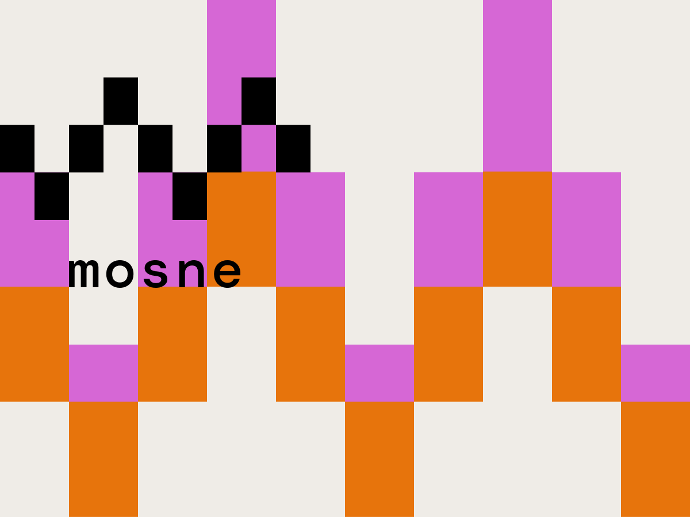

#  Mosne Front-end Framework starter theme for WordPress
##  What is Mosne FF ?

MOSNE FrontEnd Framework (FF) is a Front-end WordPress theme friendly boilerplate to help you to build your own WordPress theme with modern tools and a better productivity.



## Based on Be API FrontEnd Framewok
* [Be API FrontEnd Framewok](https://github.com/BeAPI/beapi-frontend-framework)

## Tools
* [Webpack 4](https://www.npmjs.com/package/webpack)
* [Node SASS](https://www.npmjs.com/package/node-sass)
* [SVGStore](https://www.npmjs.com/package/svgstore)
* [SVGGo](https://www.npmjs.com/package/svgstore)
* [Lazysizes](https://www.npmjs.com/package/lazysizes)
* [Eslint](https://www.npmjs.com/package/eslint)
* [Babel Loader](https://www.npmjs.com/package/babel-loader)
* [Browser Sync](https://www.npmjs.com/package/browser-sync-webpack-plugin)

## Requirements
### Node 10

You need a minimum of Node 10.

## Installation
```bash
$ cd wp-content/themes/
```
```bash
$ git clone git@github.com:mosne/mosne_ff.git your_theme_name
```
Next, go to your theme folder.

```bash
$ cd your_theme_name
```

Then install node dependencies with NPM or Yarn.
```bash
$ yarn install
```

## Configuration
### Webpack
You can edit Webpack configuration with `webpack.config.js` file and settings by editing `webpack.settings.js`.
For live editing edit the website url and the server path to the dist folder.
```javascript
  liveServer: 'https://2020.mosne.it',
  liveServerRoute: '/wp-content/themes/mosne_2020/dist',
```

### Babel
You can find a `.babelrc` file to modify Babel configuration.

### Eslint
You can find a `.eslintrc.js` file to modify Eslint configuration and ignore files in `.eslintignore`.

## How to use Mosne FF ?
After installing dependencies, you can run some commands which are explained below.

### Live Server with Browser Sync

and run a first time the following command to generate required distributions files to run the server properly.
```
$ yarn run build
```

Then, you can luch Browser Sync proxy by running :
```bash
$ yarn live
```

### Watching files for development purpose
If you don't need a local server you just can compile AND watch styles and scripts (with sourcemap) by using :

```bash
$ yarn run watch
```

### Development build
If you want to build styles and scripts (with sourcemap) by using :

```bash
$ yarn run build:dev
```

### Production build
For production purpose, you can compile all of your assets by using :

```bash
$ yarn run build:prod
```

If you want to deliver just css and assets run :

```bash
$ yarn run fast
```

### Assets
#### SVG Icons
Generate SVG sprite from the icons files in src/img/icons/ by using :

```bash
$ yarn run icons
```

### PHP Coding standads > Wordpress-Extra
#### Installing PHPCS (and phpcbf)
Download and install:

```bash
$ curl -OL https://squizlabs.github.io/PHP_CodeSniffer/phpcs.phar
$ curl -OL https://squizlabs.github.io/PHP_CodeSniffer/phpcbf.phar
$ chmod +x phpcs.phar
$ chmod +x phpcs.phar
$ sudo mv phpcs.phar /usr/local/bin/phpcs
```

#### Installing WPC
Download WordPress Coding standard:

```bash
$ git clone -b master https://github.com/WordPress-Coding-Standards/WordPress-Coding-Standards.git wpcs
```
#### Configuring PHPCS
Set the path and the default rules.
```bash
$ phpcs --config-set installed_paths ./wpcs
$ phpcs --config-set default_standard WordPress-Extra
```
Verify your configuration:
```bash
$ phpcs -i
```

#### Configure VScode
Install the following plugins:
* [phpcs](https://www.npmjs.com/package/webpack)
* [phpcbf](https://www.npmjs.com/package/node-sass)

Edit your configuration file:
```javascript
"phpcs.standard": "WordPress-Extra",
"phpcbf.enable": true,
"phpcbf.executablePath": "phpcbf",
"phpcbf.documentFormattingProvider": true,
"phpcbf.onsave": true,
"phpcbf.standard": "WordPress-Extra",
```