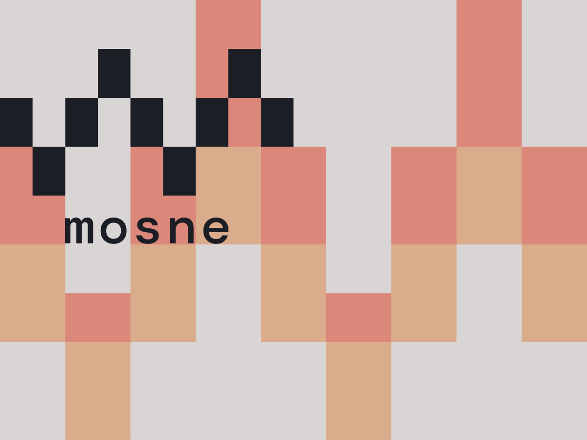

# Mosne Front-end Framework starter theme for WordPress

  [](https://app.codacy.com/gh/mosne/mosne_ff?utm_source=github.com&utm_medium=referral&utm_content=mosne/mosne_ff&utm_campaign=Badge_Grade_Settings)

## What is Mosne FF

MOSNE FrontEnd Framework (FF) is a Front-end WordPress theme friendly boilerplate to help you to build your own WordPress theme with modern tools and a better productivity.



## Based on Be API FrontEnd Framewok

-   [Be API FrontEnd Framewok](https://github.com/BeAPI/mosne)

## Requirements

### Node and Yarn

You need a minimum of Node 16.
Volta and Yarn pnp.
-   [Volta](https://volta.sh/)

## Installation

```bash
cd wp-content/themes/
```

```bash
git clone git@github.com:mosne/mosne_ff.git your_theme_name
```

Next, go to your theme folder.

```bash
rm .git
```

Then install node dependencies with Yarn.

```bash
volta install node@16
```

```bash
volta install yarn
```

```bash
yarn set version berry
```

```bash
yarn && yarn build
```

## Configuration

### Webpack

You can edit Webpack configuration with `config/entries.js` file and settings by editing `webpack.settings.js`.
For live editing edit the proxy url in the file `config/browsersync.config.js`and the server path to the dist folder.

```javascript
  proxy: `https://projectname.monse.it/`
```

## How to use Mosne FF

After installing dependencies, you can run some commands which are explained below.

### Live Server with Browser Sync

and run a first time the following command to generate required distributions files to run the server properly.

```bash
yarn build
```

Then, you can luch Browser Sync proxy by running :

```bash
yarn start
```

### Batch autofix assets

Try to auto fix JS using eslint :

```bash
yarn fixjs
```

Try to auto fix SCSS using stylelint :

```bash
yarn fixcss
```

Try to auto fix PHP using phpcbf :

```bash
yarn fixphp
```

### Coding standads

Read our wiki page to correctly configure your enviroment

-   [setup Eslint](https://github.com/mosne/mosne_ff/wiki/Eslint-setup-for-js)
-   [setup Stylelint](https://github.com/mosne/mosne_ff/wiki/Stylelint-Setup-for-Scss)
-   [setup Phpcs and Phpcbf](https://github.com/mosne/mosne_ff/wiki/Phpcs-and-Phpcbf-setup)
